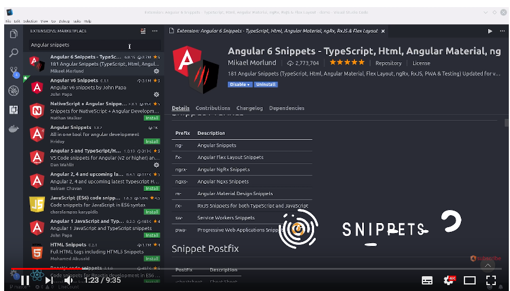

# windscribe

> 到[windscrbe](https://windscribe.com/?friend=xgcs9fnm)注册即可得到每月免费赠送的10G流量

不过在此之前，你需要over the wall。

那么如何over the wall呢？

1. 到[这个链接](http://getyangmei.com?v=oWqQ)里，注册就可临时使用1G的流量，根据其文档使用Shadowsocks客户端配置一些数据即可 
2. 使用我[这个推广](https://windscribe.com/?friend=xgcs9fnm)链接了注册windscribe，你注册成功后每月可以多得1G流量，我也可以多得1G流量。

使用windscribe的好处：

1. Twitter推送一波windscribe，可以得到5G流量，那么每个月就可以免费获取16G流量

2. 速度呢？很快，我测试了一下，可以看4k：

   

   