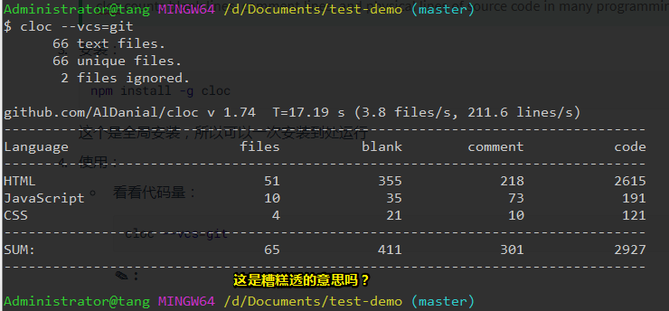

# cloc

## ★初使用

听说有个工具很好用，它叫做cloc……

既然如此，那就了解一下吧！

1. 谷歌搜索cloc，找到它的[github](https://github.com/AlDanial/cloc)，看看能否使用npm安装

2. 介绍：

   > cloc counts blank lines, comment lines, and physical lines of source code in many programming languages. 

3. 安装：

   ```bash
   npm install -g cloc  
   ```

   这个是全局安装，所以可以一次安装到处运行

4. 使用：

   - 看看代码量：

     ```bash
     cloc --vcs=git
     ```

     **✎：**

     

   - 打印帮助信息：

     ```bash
     cloc -help
     ```

     **✔：**

     ```
      --help                    Print this usage information and exit.
     ```

   