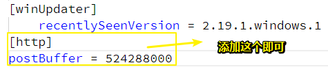

# git-cmd

1. 如何退出 `git log`？——英文状态按`q`，**✎：**

   

   不用敲回车……

   想到之前一直用 `Ctrl+c`退出也是醉了，你以为Bash「deng」的一声是没有目的的？它是在告诉你「你这种做法不好！」

2. `git fetch`

   更新git bash到最新版后，我就没有提交过gitbook的内容了，今天需要提交一次，按照日常的做法就是，运行两个脚本文件就可以更新远程仓库的内容了，然后报错了，**✎：**

   `error: pathspec 'JavaScript实现之一ES' did not match any file(s) known to git`

   什么鬼？我也是醉了，只好搜索了（别忘了加`""`双引号），根据这个，**➹：**

   [Git使用之(pathspec master did not match any file(s) known to git) - CSDN博客](https://blog.csdn.net/wankui/article/details/53328369)

   其实我也不知道为什么可以解决，觉是是这个 `git fetch`起到了作用，这个命名的解释，**✎：**

   > `git fetch` 相当于是从远程获取最新版本到本地，不会自动merge 

   **？：**为何我用VSCode的git提交的内容就不受影响呢？真是奇怪……

   ps：这是提交的时候有空格仅此而已，即语法错了哈！

3. git push报错了「`fatal: The remote end hung up unexpectedly`」，如何解决呢？

   首先你要知道为什么会报错对吧！

   那是因为推送的文件太大

   那么如何解决呢？

   往`~/.gticonfig`中添加提交缓冲大小为500M

   

