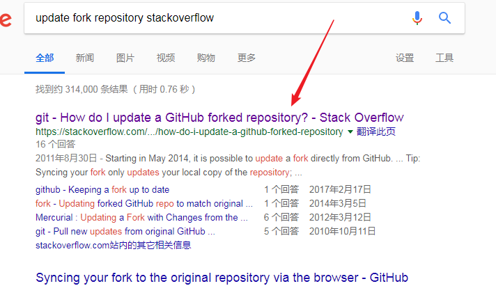
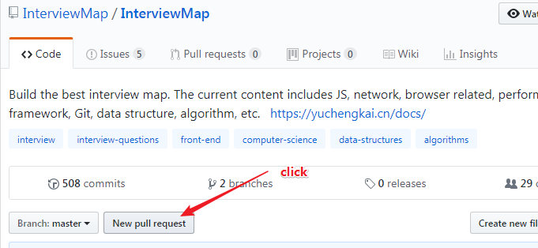
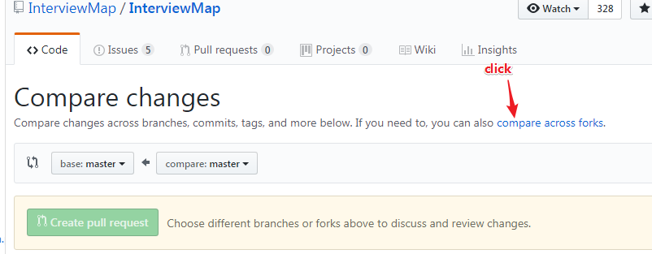
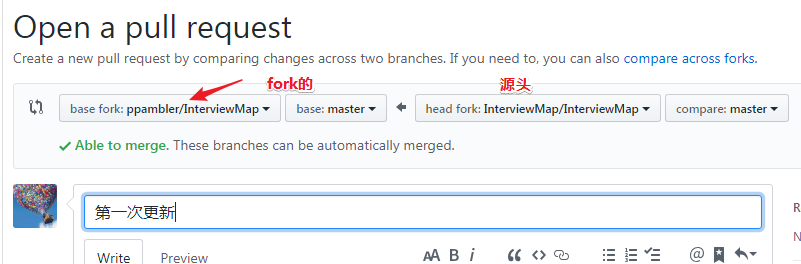
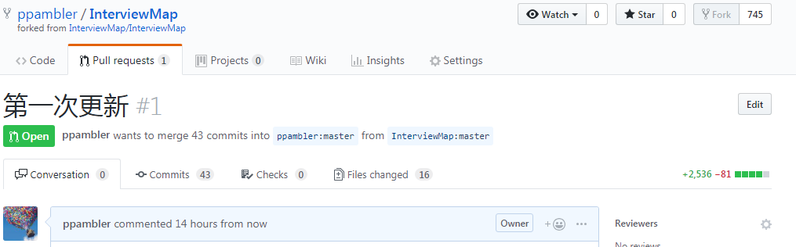
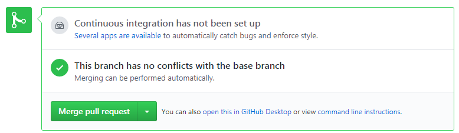

# github

> 使用github遇到的问题，以及如何解决它们，当然，方法不是唯一的……

### ①如何更新fork的仓库？

> 某个时间段里，你在同性交友网站（github）里漫游，偶遇了一个仓库，你对它一见钟情，为此，你fork它下来了。又过了一段时间，你去找它，看看它过得怎样……结果你发现它有变化，即更新了，此时，你就在想「它更新了，那我fork它的，会更新吗？」——结果，没有更新。
>
> 所以，我该怎么做呢？

我要谷歌搜索，为此我的搜索关键词是这样的： `fork  pull  github`

搜索出来的结果，我是无法预料的，就这样找到了一个合适的结果：

[How do I update a GitHub forked repository?](https://stackoverflow.com/questions/7244321/how-do-i-update-a-github-forked-repository)

ps：搜索关键词有待提高，因为这个结果不是在第一位的……如果非要是搜索出来的第一个结果，那么关键词：`update fork repository stackoverflow`就是这个样子

**✎：**

1. 我想要更新我fork下来的这个[仓库](https://github.com/ppambler/InterviewMap/blob/master/README-ZH.md)——`xxx`

2. 点击这个到源头`xxx`

   

3. 点击 `New pull request`

   

4. 点击  `compare across forks`

   

5. 改一下默认的选项：

   

   然后，你点一下—— `Create pull request`，这会跳转你的用户名下……

   

   接着，你就滚动页面，你会发现有个 `Merge pull request`的绿色按钮，你就点击它就可以大致完成你的需求了……

   

   

