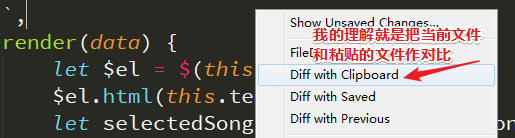
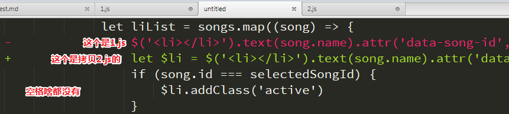

# skill

## ★比较两个文件的差异

> 有`1.js`和`2.js`这两个文件，为什么要比较呢？我照着B这个文件往A文件里敲了一遍，发现A报错了！我真是无言以怼，我又没有血轮眼，那么多行demo，哪来的眼力劲可以识别啊！告诉我该怎么办！

我知道有个叫beyond compare的工具，听说很强大，说是程序员必备的工具啊！

**➹：**[beyond compare 程序员必备吗，有哪些替代工具 ，有哪些别的工具不能替代的功能？ - 知乎](https://www.zhihu.com/question/54680382)

我稍微看了一下答案，发现它是收费的哈！我在某个答案中找到有个工具也很强大——[Meld](http://meldmerge.org) ，当然，因为它是开源的哈！

为此我下载用了它一下！结果发现，它对比的太详细了，空格字符也比较了！（或许我对它的其它功能没有了解过），这就GG了啊！

既然不行，那就看看VSCode有没有对应的插件就好了，说实在的，我对VSCode的插件使用是一无所知的！就这样我又放弃了这个做法！

偶然的，我用sublimeText打开了这个两个文件，对某个文件一不下心就右击了，发现有这么一个选项，**✎：**

结果，有个无名文件跳出来了，**✎：**

可见，我少敲了`let $li  =`，才导致问题的发生！

我突然认识到sublime Text是多么的强大！→☞sublime「 庄严的；令人崇敬的；极端的；超群的 」

或许你对工具的使用只是冰山一角……

