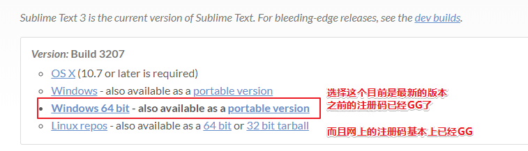
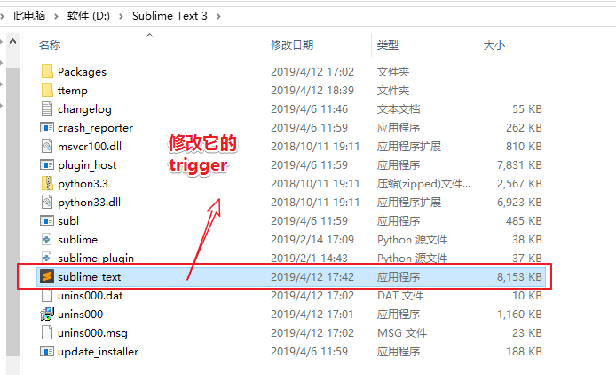
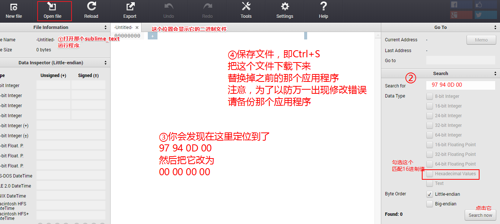
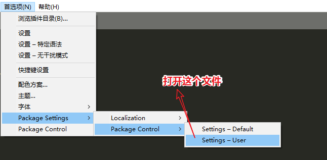
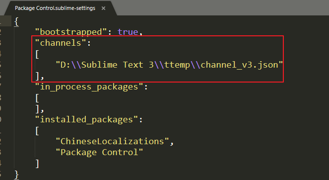
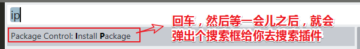
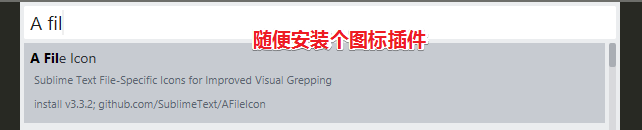

# Sublime Text

## ★注册码

### ◇Windows

此验证码为 sublime text3 注册码 ：

```java
----- BEGIN LICENSE -----
sgbteam
Single User License
EA7E-1153259
8891CBB9 F1513E4F 1A3405C1 A865D53F
115F202E 7B91AB2D 0D2A40ED 352B269B
76E84F0B CD69BFC7 59F2DFEF E267328F
215652A3 E88F9D8F 4C38E3BA 5B2DAAE4
969624E7 DC9CD4D5 717FB40C 1B9738CF
20B3C4F1 E917B5B3 87C38D9C ACCE7DD8
5F7EF854 86B9743C FADC04AA FB0DA5C0
F913BE58 42FEA319 F954EFDD AE881E0B
------ END LICENSE ------
```

还有一点就是，你需要改hosts，不然，注册一会儿就失效了

```
127.0.0.1       www.sublimetext.com
127.0.0.1       license.sublimehq.com
```

**➹：**[Sublime Text 3.1 3170 / 3176 注册码（附降级与禁止更新方法）](https://fatesinger.com/100237)

## ★重新安装

由于重装了系统，所以就重新下载了最新版的[sublimeText](https://www.sublimetext.com/3)



3207这个版本安装以后后，不管你输入什么合理的注册码，结果无非就是**要么需要把注册码升级一下，要么就是因为共享license key的姿势已经GG**

那么如何才能把这个版本的sublimeText给注册号呢？

1. 修改验证license时的trigger
2. 修改host

### ◇修改trigger



使用这个在线编辑器即可：

**➹：**[HexEd.it - -Untitled-](https://hexed.it/)




### ◇修改host，以防联网验证时，激活凉凉

```
127.0.0.1 license.sublimehq.com
127.0.0.1 www.sublimetext.com
50.116.34.243 sublime.wbond.net
50.116.34.243 packagecontrol.io
```

### ◇激活

```
----- BEGIN LICENSE -----
TwitterInc
200 User License
EA7E-890007
1D77F72E 390CDD93 4DCBA022 FAF60790
61AA12C0 A37081C5 D0316412 4584D136
94D7F7D4 95BC8C1C 527DA828 560BB037
D1EDDD8C AE7B379F 50C9D69D B35179EF
2FE898C4 8E4277A8 555CE714 E1FB0E43
D5D52613 C3D12E98 BC49967F 7652EED2
9D2D2E61 67610860 6D338B72 5CF95C69
E36B85CC 84991F19 7575D828 470A92AB
------ END LICENSE ------
```

可见激活成功了

### ◇安装 `Install Package Control`

要安装这个包需要在host里边添加这两行东西：

```
50.116.34.243 sublime.wbond.net
50.116.34.243 packagecontrol.io
```

不然，你是无法安装这个包的！

然而即便安装了这个包，也无法安装其他插件，因为你还需要配置个channel_v3.json文件才行！



接着配置那个文件路径：



那个文件的下载地址：

**➹：**[https://packagecontrol.io/channel_v3.json](https://packagecontrol.io/channel_v3.json)

直接`Ctrl+S`即可下载这个json文件了！

### ◇测试

> Ctrl+shift+p，ip，等一会儿
>
> 

1. 安装个汉化插件，输入 localization 选择 `ChineseLocalizitions`

2. 安装个显示文件类型图标的插件：

   

   

**➹：**[Sublime Text3 注册码激活码(持续更新中2019-03-20) - 玉林路扛把子 - CSDN博客](https://blog.csdn.net/qq_29819449/article/details/80130327)

**➹：**[【原创】【全平台】【04.12更新】【中文】Sublime Text 3 3207 激活 - 『精品软件区』 - 吾爱破解 - LCG - LSG -安卓破解-病毒分析-破解软件-www.52pojie.cn](https://www.52pojie.cn/thread-925256-1-1.html)

**➹：**[sublimetext3 安装 install package control 不能安装 - kevinx_xu的专栏 - CSDN博客](https://blog.csdn.net/kevinx_xu/article/details/87195349)

**➹：**[Sublime text3无法安装package control (2019年春节后) - Peter_cup的博客 - CSDN博客](https://blog.csdn.net/Peter_cup/article/details/87718966)

**➹：**[解决sublime package control 出现There are no packages available for installation - 努力改变人生！ - CSDN博客](https://blog.csdn.net/zknxx/article/details/52685094)


