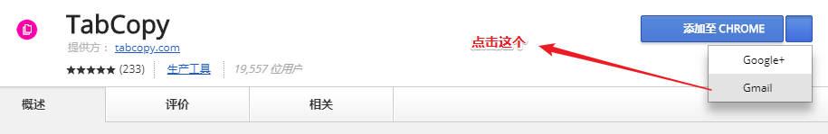
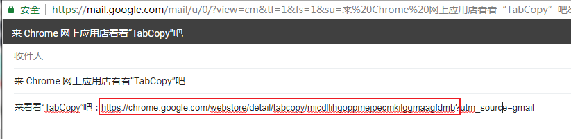
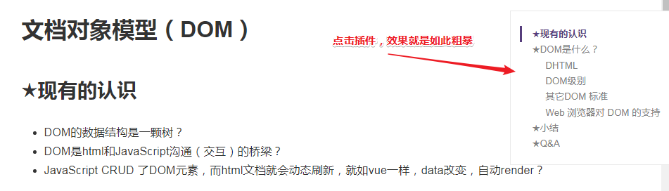

# chrome-plug-in

## ★插件下载中断

> 我一直都在复制文章标题、链接什么的，觉得这样很繁琐，我就试着找找看有没有可以完成类似工作的插件
>
> 结果找到一个[TabCopy](https://chrome.google.com/webstore/search/tabcopy?utm_source=chrome-ntp-icon)，然而我却下载失败了，这不是vpn的原因，我带着这样的关键字搜索 `chrome 插件下载中断`，找到这个链接**➹：**[chrome - chrome商店下载失败(无法连接到服务器) | 下载中断](http://www.echojb.com/web-application-server/2017/04/20/355381.html)

我就按着它的步骤来：

1. 分享到Gmail

   

2. 这分享页面打开有点慢，不过，也无关紧要了，这不是重点，拷贝框住的字符（没有那个问号）

   

   **✎：**

   `https://chrome.google.com/webstore/detail/tabcopy/micdllihgoppmejpecmkilggmaagfdmb`

3. 打开[Chrome Extension Downloader](https://chrome-extension-downloader.com)这个链接

   把复制过来的链接，扔过来下载即可，**✎：**

   

4. 如何安装下载下来的插件呢？

   到这里去： `chrome://extensions/`，然后拖动下载过来的插件即可，如果拖动不成功就勾选这个按钮：

   

   ps：我没有找到关于它的[快捷键](https://support.google.com/chrome/answer/157179?hl=zh-Hans)，或许是没有的哈！

## ★TOC

> 当一篇文章过长的时候，而文章又有划分标题的时候，TOC插件就可以创建一个目录，让文章脉路更清晰，使得更容易消化 

**➹：** [Smart TOC](https://chrome.google.com/webstore/detail/smart-toc/lifgeihcfpkmmlfjbailfpfhbahhibba) 

**✎：**

