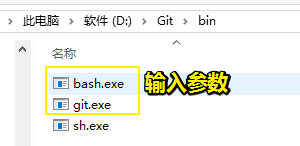
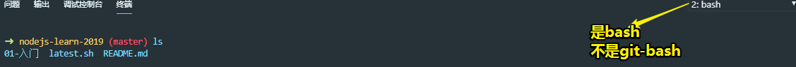

# 用户设置

## ★设置终端为Bash

> 找到Git的安装目录：
>
> 

```json
{
    "terminal.integrated.shell.windows": "D:\\Git\\bin\\bash.exe",
    "git.path": "D:\\Git\\bin\\git.exe"
}
```

不要弄成是 `"terminal.integrated.shell.windows": "D:\\Git\\git-bash.exe"`，不然每次启动终端都会重新打开一个终端窗口，而不是在vscode里边打开一个终端！

效果：



**➹：**[visual-studio-code - vsCode 终端打开 出现问题（终端进程命令“/bin/bash -l”无法启动 (退出代码: 1)） - SegmentFault 思否](https://segmentfault.com/q/1010000015458304)

