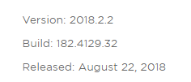

# README

## ★使用原因

听说很好用，而且如果一个项目复杂起来了，这是标配！

## ★安装

1. 官网下载，**✎：** [Download WebStorm: The Smartest JavaScript IDE by JetBrains](https://www.jetbrains.com/webstorm/download/#section=windows)

   

2. 安装，没有勾选的选项——32-bit和jre

## ★激活

老实说，我是不知道激活和破解的区别的，**✎：**

**➹：**[使用正版 Office 套件和使用盗版激活的有什么区别？ - 知乎](https://www.zhihu.com/question/263685284)

**➹：**[所有软件都可以被破解吗？为什么网上破解软件那么多，软件开发者难道没有好的办法防止其软件被破解吗？ - 知乎](https://www.zhihu.com/question/29372527)

那么如何激活呢？

**➹：**[Jetbrains系列产品2018.2.2最新激活方法 | 知了](https://zhile.io/2018/08/17/jetbrains-license-server-crack.html)

1. 根据文章的操作来即可

一些细节，**✎：**

1. 有一个叫安装目录，还有一个叫用户目录，这是你之前不知道的！

   1. `/e/Software/WebStorm 2018.2.2`
   2. `/c/Users/Administrator/.WebStorm2018.2/config`，总之就是这样 `%UserProfile%\.WebStorm2018.2\config `

   ps：目录名有空格，请用单引号包裹起来，毕竟空格是有意义的

2. 关于路径问题

   1. windows里的地址都是类似 `C:\xxx\yyy\zzz`
   2. 不要把MINGW64当windows的终端，所以不要这这样—— `/c/user/……`

激活成功后的信息，**✎：**

