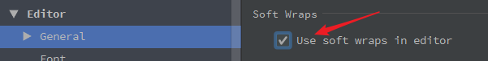

# settings

## ★字体选择

**➹：**[Helvetica 字体和 Helvetica Neue 字体有什么区别？ - 知乎](https://www.zhihu.com/question/20683099)

**➹：**[程序员编程看起来最舒服的字体（英文的和中文的）、字号、颜色和背景色是什么？ - 知乎](https://www.zhihu.com/question/19637242)

我需要下载这个[Helvetica Neue字体](http://www.epinv.com/post/2674.html)，**✎：**

1. 把所需的字体到拖到这个目录下面去 `C:\Windows\Fonts`即可，而且是会自动安装的！

## ★主题

**➹：**[webstorm：求一个黑色背景 好看的webstorm主题? - 柳星的回答 - 知乎](https://www.zhihu.com/question/35413120/answer/137130699)

安装了这个答案所说的主题

ps：没想到主题会把这个IDE的布局等都给变了！这是我没有想过的，我以为只是代码的编辑区域会有变化！老实说这个IDE我真得不会用！

## ★长话短说

1. 自动换行：

   

   https://www.jianshu.com/p/69c9f0f7f685

2. Git配置，**✎：**

   1. 绑定github账户。

      

   2. 配置git

      

   3. 我做了、2步骤后发现，无法在文件修改后commit，这让我很抓狂，我就在想还是用回vscode好了。出去逛了一圈回来后，还是不死心，于是就找到了这个答案，**✎：**

      **➹：**[idea使用git的时候，修改后文件变蓝后马上就变白，没有要提交的文件 - 开源中国社区](https://www.oschina.net/question/1261699_2193027?sort=default&p=2)

      

